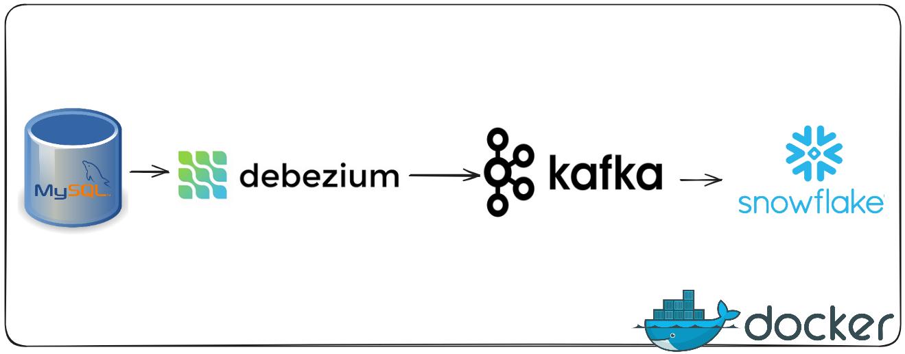
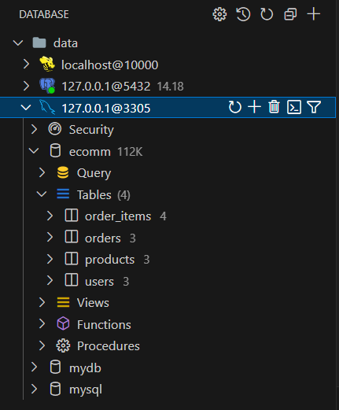
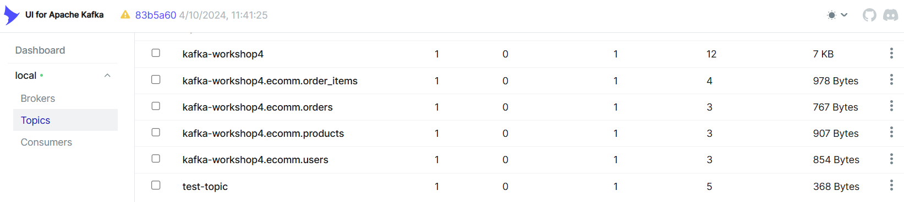
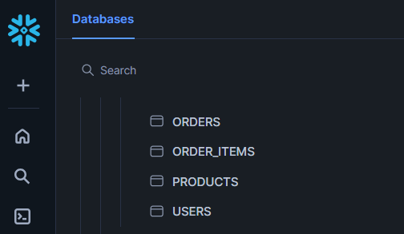

# Real-Time CDC Streaming Pipeline with Kafka, Debezium, and Snowflake

This project demonstrates a real-time Change Data Capture (CDC) streaming pipeline that captures changes from a MySQL source database using Debezium, processes them through Apache Kafka, and kafka sink the data into Snowflake using the Kafka Snowflake Connector.

---

- Set up a real-time Change Data Capture (CDC) pipeline using Apache Kafka Connect as the integration layer. 
- Connect MySQL as the source database using the Debezium MySQL Connector to capture real-time changes.
- Debezium publishes all data change events to Kafka topics in a structured format.
- Deploy the Kafka Snowflake Connector to consume messages from Kafka topics and write them into Snowflake.
- The connector streams data into Snowflake tables using Snowpipe, enabling near real-time ingestion and analytics.
- Run the entire pipeline including MySQL, Kafka, Debezium, and connectors using Docker Compose.

---

# mysql source database

# kafka topics

# Snowflake data warehouse

